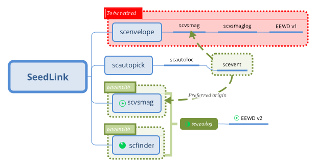

# sceewlog : software specifications and required developments

## Introduction
In the following we outline the technical specifications for  `sceewlog` , the next version of `scvsmaglog` which will be compatible with FinDer and any other magnitudes.

### EEW plans at SED
The  `scvsmaglog`  and `sceewlog` programs are part of the SED-EEW package. This has been first introduced to implement the Virtual Seismologist in SeisComP3 in 2014 in parallel to SED' compagnion EEW display software (EEWD). The SED-EEW package has been extended in 2016 with the implementation of FinDer in private addons. The developemnt of `sceewlog` is part of a renewed effort since 2018 to bring both VS and FinDer warnings into EEWD.  The overall scheme of EEW plans at SED is given below.



### Design
The  `scvsmaglog`  and `sceewlog` programs are SeisComP3 modules developed by SED-ETHZ to:
- receive magnitudes-related metadata,
- convert magnitudes-related metadata into quakeml-rt or shakealert  if requested, 
- transmit magnitudes-related metadata thought an activeMQ interface if configured,
- save a summary report of the magnitude(s) evolution report to disk if requested,
- send the report though email if requested.
`sceewlog`  will incorportate all existing material from  `scvsmaglog`, see <http://seiscomp3.org/doc/jakarta/current/apps/scvsmaglog.html> for a full description.

### Note
After filtering only MVS magnitudes, the  `scvsmaglog`  program requires three things for a magnitude to be logged:
- the magnitude related origin needs to have arrivals and picks,
- the magnitude needs to have a comment of type "update" that provides an update number,
- the magnitude needs to have a comment of type "likelihood"  that provides a likelihood value.
The implementation of   `scvsmaglog` will require to get rid of these limitations.  

## Structure 
`sceewlog` is integrated inside the structure of the SED-EEW package. This package is in `sed-addons/apps/eew` and can be included in `SeisComP3/src/` for seamless compilation. `SeisComP3/src/sed-addons/apps/eew` includes a general documentation (an `rst` file)  explaining `libeewenv` and listing all the modules currently provided by the package:
- sceewenv (already existing, see <https://gitlab.seismo.ethz.ch/SED-EEW/sed-addons>)
- scfinder (already existing, see <https://gitlab.seismo.ethz.ch/SED-EEW/sed-addons>)
- sceewlog (to do)


### Note
This is relying on the separate development (and documentation) of the SED-EEW package and of sceewenv.

## Specifications
### Generalities
These specifications are required for all SED' EEW modules:
- Integrate in SeisComP3.
- Develop with git using <http://gitlab.seismo.ethz.ch/SED-EEW/sed-addons>.
- Include the full descriptions (name, type, default value and usage) of all the parameters in the SeisComP3-compatible description file i.e. <http://gitlab.seismo.ethz.ch/SED-EEW/sed-addons/eew/sceewlog/sceewlog.xml>.
 
 ### Note
 The new parameters suggested in the next section are already listed in <http://gitlab.seismo.ethz.ch/SED-EEW/sed-addons/eew/sceewlog/sceewlog.xml> 
 
### For `sceewlog`
- Keep all existing capacities of scvsmaglog (see <http://seiscomp3.org/doc/jakarta/current/apps/scvsmaglog.html>):
  - Reuse the code of scvsmaglog and rename as sceewlog and adapt the names of all related files (e.g. `VS_reports` becomes `EEW_reports`).
  - Move sceewlog to its own directory inside the SED-EEW package and develop in <http://gitlab.seismo.ethz.ch/SED-EEW/sed-addons/apps/eew/sceewlog/>
- Improve compatibility with other magnitude types than MVS:
  - Add the capacity to log specific magnitude type or types.
  - Add a parameter to configure the list of magnitude types to be logged.
  - Add capacity to log with origins which have no pick, no update comments or likelihood comments (e.g. scfinder).
  - Change the logic of magnitude ordering in the `EEW_report/` files for ordering by creation time instead of update number.  
  - Add magnitude type, rupture strike and length in reports (written to disk and sent by email, next section).
  - Add rupture parameters in XML alert messages (sent to the ActiveMQ interface).
- Add `--playback` and `-I` options for sequential post-processing of a data file containing events in a real-time manner (respecting the creation times of input elements). 

### Specifications of the reports
As `scvsmaglog`, `sceewlog` generates a report (written to disk and sent by email) once an event has timed out. An example is given below:

```
Tdiff   |Type|Mag.|Lat.  |Lon.   |Depth |origin time (UTC)        |likeh.|#st.(org.) |#st.(mag.) |Strike |Length |author    |      creation time (UTC) 
------------------------------------------------------------------------------------------------------------------------------------------------------
 23.6324| MVS|2.01| 46.29|   7.62|  3.65|2018-03-27T10:42:31.7209Z|  0.12|          6|      5    |       |       |   scvsmag|2018-03-27T10:42:52.7209Z
 24.6315| Mfd|2.01| 46.29|   7.62|  3.65|2018-03-27T10:42:31.7209Z|  0.12|           |     15    |    345|   0.05|  scfinder|2018-03-27T10:42:53.7209Z
```

## Tests
- Demonstrate all outputs are the same while only MVS is configured in the magnitude type list.
- Demonstrate all configured outputs are correct while more magnitude types are configured.
- Demonstrate  that `sceewlog`  is is at least as fast as  `scvsmaglog` to produce the same outputs.

## Documentation
- Update documentation with additions and changes in the last version of the code.
