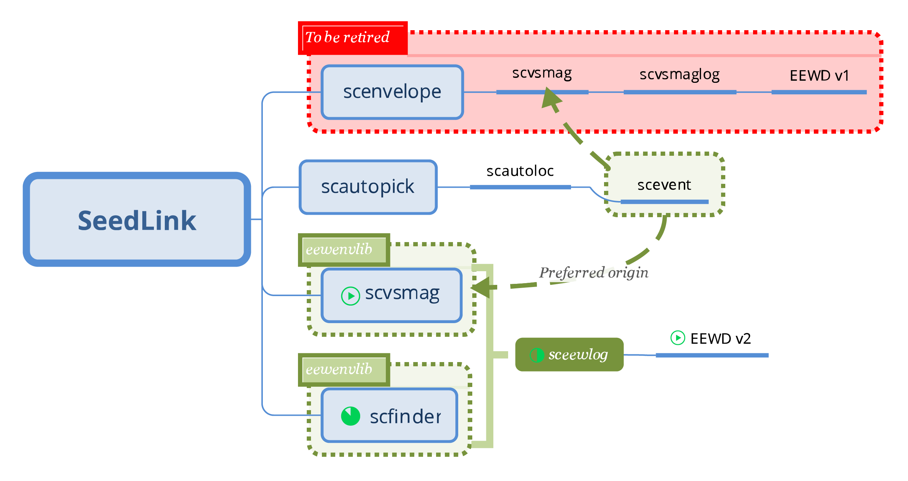

# sceewlog : software specifications and required developments

## Introduction
In the following we outline the technical specifications for the  `sceewlog` software, the next version of `scvsmaglog` which will be compatible with FinDer and any magnitude type. 

### EEW plans at SED
The  `scvsmaglog`  and `sceewlog` programs are part of the SED-EEW package. This package first introduced in 2014 a SeisComP3 implementation of the Virtual Seismologist compatible with SED' EEW display software ([EEWD code repository link](https://gitlab.seismo.ethz.ch/SED-EEW/EEWD). The SED-EEW package has been extended in 2016 with the implementation of FinDer in private addons. Since 2018 the development of `sceewlog` is part of a renewed effort  to use the envelope processor developed for FinDer and to bring both VS and FinDer early warnings into EEWD using SeisComP3.  

The overall scheme of EEW plans at SED is illustrated below.


### Package structure 
`sceewlog` will be developed inside the SED-EEW package and  pushed to the main SeisComP3 repository when ready. The SED-EEW  package is in `sed-addons/apps/eew` and can be included in `SeisComP3/src/sed/` for seamless compilation within SeisComP3. When `sceewlog` will be ready for open-source distribution it will be included inside `SeisComP3/src/sed/eew/`.

`SeisComP3/src/sed-addons/apps/eew` includes a general documentation (an `rst` file)  listing all the modules currently provided by the package:
- `sceewenv` (already existing, see the [sed-addons repository](https://gitlab.seismo.ethz.ch/SED-EEW/sed-addons))
- `scfinder` (already existing, see the [sed-addons repository](https://gitlab.seismo.ethz.ch/SED-EEW/sed-addons))
- sceewlog (to do)

### Design of the `sc*log` softwares
The  `scvsmaglog`  program is a SeisComP3 module developed by SED-ETHZ to:
- listen to magnitudes-related metadata within SeisComP3 (i.e. magnitudes, magnitude comments, origins and picks),
- filter only the MVS magnitude type and related metadata,
- convert MVS metadata into quakeml-rt or shakealert xml format if requested, 
- transmit MVS metadata in real time through an activeMQ interface if configured,
- save a summary report of the MVS evolution report to disk if requested,
- send the report through email if requested.
The `sceewlog` program will incorporate all the functionalities of  `scvsmaglog`. In addition, `sceewlog`  will be able to process one or several magnitude types specified as a list. 

### Important implementation note
After filtering only MVS magnitudes, the  `scvsmaglog`  program requires three things for a magnitude to be processed:
- the magnitude-related origin needs to have arrivals and picks,
- the magnitude needs to have a comment of type "update" that provides an update number (this triggers the construction of the report),
- the magnitude needs to have a comment of type "likelihood"  that provides a likelihood value (this triggers sending the report via email and writing it to disk).
The implementation of  `sceewlog` will require to get rid of  the first two limitations at least.  See the `scvsmaglog` [documentation](https://www.seiscomp3.org/doc/jakarta/current/apps/scvsmaglog.html) and [source code](https://github.com/SeisComP3/seiscomp3/blob/master/src/sed/apps/scvsmag/scvsmaglog.py) for a full description. 

## Specifications
### General specifications
These specifications are required for all SED-EEW modules:
- Integration in SeisComP3.
- Development with git using the [SED-EEW/sed-addons repository](http://gitlab.seismo.ethz.ch/SED-EEW/sed-addons).
- Update and inclusion of the full descriptions (name, type, default value and usage) of all the parameters in the SeisComP3-compatible [description file already available in the repository](https://gitlab.seismo.ethz.ch/SED-EEW/sed-addons/blob/master/apps/eew/sceewlog/descriptions/sceewlog.xml).
 
### Reading notes
- Some of the required tasks below are actually already fullfiled. These are indicated with the prefix: `|Done|`. 
- The new parameters suggested in the next section are already listed in [the parameter description file](https://gitlab.seismo.ethz.ch/SED-EEW/sed-addons/blob/master/apps/eew/sceewlog/descriptions/sceewlog.xml), direct links to suggested parameters are provided inline.
- Some of the new codes suggested in the next section are already drafted in a [source code file](https://gitlab.seismo.ethz.ch/SED-EEW/sed-addons/blob/master/apps/eew/sceewlog/sceewlog.py), direct links to suggested codes are provided inline.
 
### Specifications for  `sceewlog`
- Keep all existing capacities of `scvsmaglog` (see  [documentation](https://www.seiscomp3.org/doc/jakarta/current/apps/scvsmaglog.html) and [source code](https://github.com/SeisComP3/seiscomp3/blob/master/src/sed/apps/scvsmag/scvsmaglog.py) ):
  - `|Done|` Move `scvsmaglog` to its own directory inside the SED-EEW package and develop in SED-EEW' [sed-addons/apps/eew/sceewlog/](http://gitlab.seismo.ethz.ch/SED-EEW/sed-addons/blob/master/apps/eew/sceewlog/)
  - `|Done|` Reuse the code of `scvsmaglog` and rename as `sceewlog` and adapt the names of all related files (e.g. `VS_reports` becomes `EEW_reports`). This is given as a parameter (`name="directory" type="dir" default="~/.seiscomp3/log/EEW_reports"`, see  [line 95 of the parameter description file](https://gitlab.seismo.ethz.ch/SED-EEW/sed-addons/blob/master/apps/eew/sceewlog/descriptions/sceewlog.xml#L95)
  - `|Done|` Edit  [sceewlog/CMakeLists.txt](https://gitlab.seismo.ethz.ch/SED-EEW/sed-addons/blob/master/apps/eew/sceewlog/CMakeLists.txt) as required so `sceewlog` is built within SeisComP3.
- Add the capacity to log specific magnitude type or types and improve compatibility with other magnitude types than MVS:
  - Add a parameter to configure the list of magnitude types to be logged (e.g. `name="magTypes" type="list:string" default="MVS, Mfd"`, see [line 78 of the parameter description file](https://gitlab.seismo.ethz.ch/SED-EEW/sed-addons/blob/master/apps/eew/sceewlog/descriptions/sceewlog.xml#L78)). 
  - Add codes to log only the configured magnitude types (see [source code line 247](https://gitlab.seismo.ethz.ch/SED-EEW/sed-addons/blob/master/apps/eew/sceewlog/sceewlog.py#L247))
  - Change the logic of magnitude sorting in the `EEW_report/` files in order to sort by creation time instead of update number and move processing triggered by the reception of update number to the reception of likelyhood (see [source code line 362](https://gitlab.seismo.ethz.ch/SED-EEW/sed-addons/blob/master/apps/eew/sceewlog/sceewlog.py#L362)). Consider using a separate method to add the magnitude metadata to the `sceewlog` report table (`self.event_dict[evID]['updates']`). 
  - Insure capacity to log with origins without pick or magnitude without update comments (e.g. `scfinder`) and add the required logic to do so. 
  - Add  in reports (written to disk and sent by email, see next section) the rupture strike and length (both provided by `scfinder`) as well as magnitude types.
  - Change the xml conversion stylesheets to add rupture parameters in XML alert messages (sent to the ActiveMQ interface).

### Specifications of the reports
As `scvsmaglog`, `sceewlog` generates a report once an event has timed out. An example of the format of the reports from `sceewlog`  is given below:

```
                                                                  |#St.   |
Tdiff |Type|Mag.|Lat.  |Lon.   |Depth |Origin time (UTC)     |Lik.|Or.|Ma.|Str.|Len. |Author   |Creation t.
-----------------------------------------------------------------------------------------------------------
 23.63| MVS|2.01| 46.29|   7.62|  3.65|2018-03-27T10:42:31.72|0.12|  6|  5|    |     |  scvsmag|10:42:52.72
 24.63| Mfd|2.01| 46.29|   7.62|  3.65|2018-03-27T10:42:31.72|0.99|   | 15| 345| 0.05| scfinder|10:42:53.72
```

### Further functionalities
Further functionalities might also be developed if time allows. These extra functionalities might actually be required while developing functionalities of the inital specifications.:
- Insure capacity to log with any magnitudes without likelihood comments. 
- Add `--playback` and `-I` options for sequential post-processing of a data file containing events as in a real-time manner (respecting the creation times of input elements). 
- Pass envelope and / or amplitude through the  ActiveMQ interface. This will require either to run a separe `sceewenv` instance or including the  `libeewenv`  library in `sceewlog`.

## Tests
- Demonstrate all outputs are the same while only MVS is configured in the magnitude type list.
- Demonstrate all configured outputs are correct while more magnitude types are configured.
- Demonstrate  that `sceewlog`  is at least as fast as  `scvsmaglog` to produce the same outputs.

## Documentation
- Recycle and update the  `scvsmaglog`  documentation for  `sceewlog`  with additions and changes in the last version of the code.


